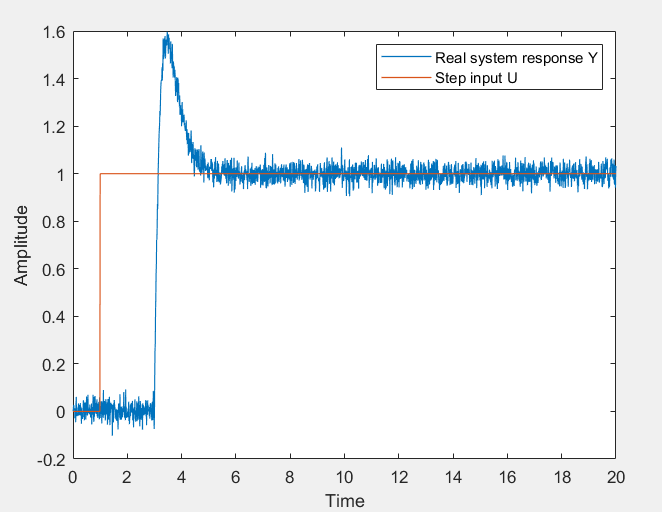

# system-idenfitication
This example is similar to the "2nd_order_demo" but it also includes the impact of transport delay in the real system

The real system is simulated using the following Simulink model:

The "real" system consists of a 2nd order transfer function with transport delay of 2 seconds, and a white noise component to make indentification more challenging.

An overshoot at the step response and oscillation suggest that the system should be estimated with at least second order transfer function. It's certain that the response is not immediate and the use of transport delay should be taken into account.

Based on step response, I manually calculated how many samples is the transport delay. I create an offset data and try to fit a model to it,

I used the ssest() function to identify model with an a function of an appropriate order and it turned out that the second order tr. function fits the data well.

Next, I add the delay back to the transfer function

Let's compare the results. As for the first the estimated model response was compared to a real system step input. 

The model was validated with independent data set. Here's how it looks like:

Although the "real" system wasn't complex, the results are significantly correct and the estimated model reproduces the system behaviour.
