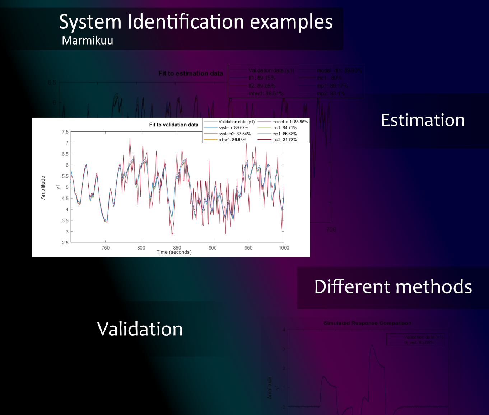

# system-idenfitication
This repository contains examples on system identification in MATLAB. With the future releases I will include also a Python examples with sysidentpy library (more information at: https://sysidentpy.org/).

In fact, it is some sort of "my record" of the learning process in system identification. Whenever I read about some new piece of information about a new concept, I create a new example and try to implement it. Although the results could be better, I see this as a place for me to experiment and to share my work. 

Why learning system identification? Because it will come in handy in my other projects which use "model-based" approach: 

-State of Charge (SoC) Estimation with EKF

- My final year project of which part is comparision of different automatic control algorithms implemented on a PLC controller - it's easier to identify model and then develop software with simulation. Then I validate the control software on the real plant;

- Linear actuator from the ink printer: the project will be continued soon