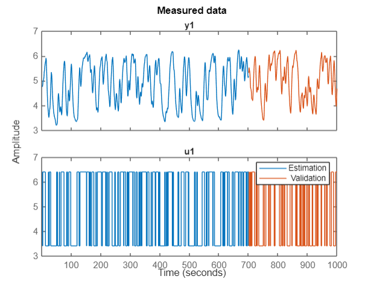
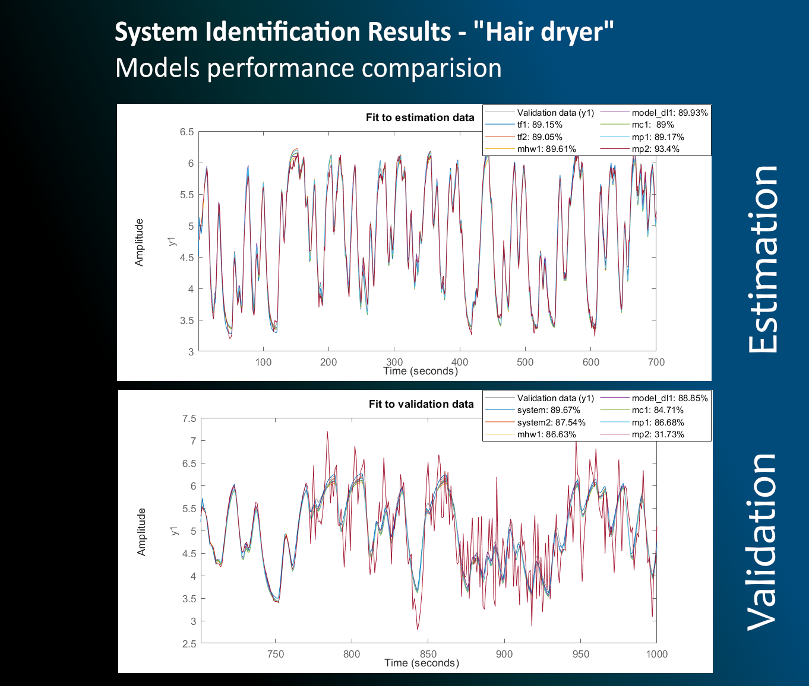

# system-idenfitication

"Hair dryer" system identification

	"Laboratory setup acting like a hair dryer. Air is fanned through a tube
	and heated at the inlet. The air temperature is measured by a 
	thermocouple at the output. The input is the voltage over the heating 
	device (a mesh of resistor wires)."
Inputs:
	u: voltage of the heating device 
Outputs:
	y: output air temperature 

Measured data set:

It was divided to estimation and validation data sets. The independent validation data set will be used to check the models accuracy.

Results and conclusion:

I've tried different approaches and methods;
Hammerstein-Wiener, DL nlarx, transfer functions, etc - more description was provided in Matlab LiveScript file - it can be re-run and more information will be available - here's just an overview in a nutshell;

It turns out that the estimated models fit to the validation data at 80%;

