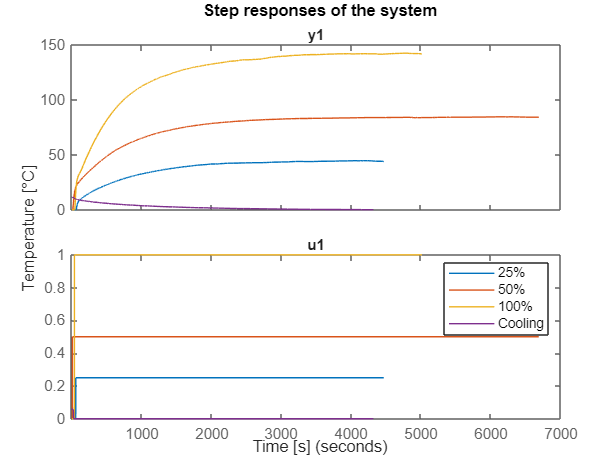
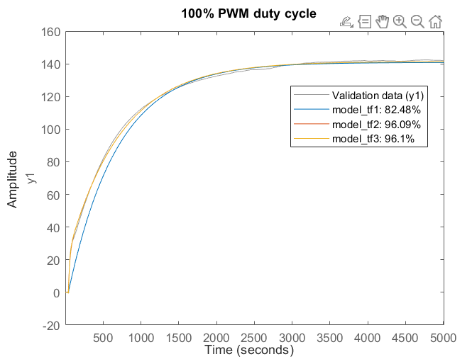
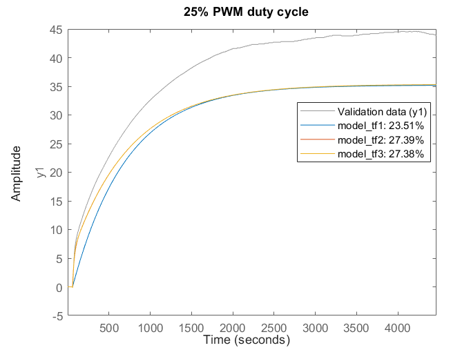
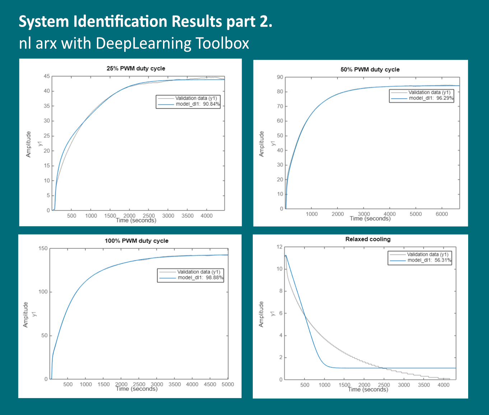
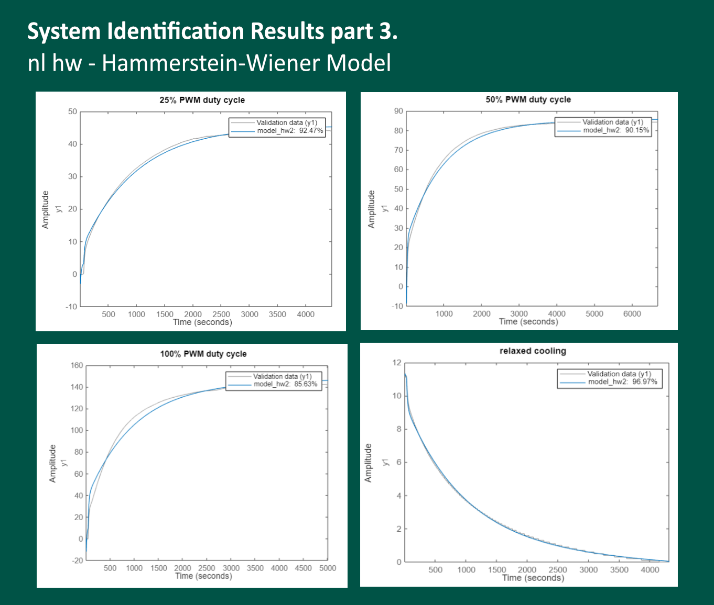

# Real thermal system
In this example, I will attempt to identify real thermal plant - it was controlled by Mitsubishi FX5CPU PLC in a laboratory setting;

The real plant consist of a metal sheet enclosure with Pt100 temperature sensor and a hot-end heater controlled with PWM signal through SSR(solid state relay);

Measured data sets: 25%, 50% and 100% PWM duty cycle + relaxed cooling data;

Results and conclusion:
I've tried different approaches and methods, but it turned out that:

- Estimated transfer function with delay does not fit to the validation data well. As transfer functions usually work well with Linear Time-Invariant systems (LTI), they do struggle with nonlinear dynamics;
 

- nlarx model with DeepLearning Toolbox worked well. The fit to the validation data tends to be above 90% and the system's step response is stable and it looks like 100% PWM duty cycle respose (in fact, it's just step response);

- Hammerstein-Wiener model
nlarx HW model fits to the validation data in excellent way. Therefore it could be a suitable model structure, but as it turned out at validation stage, the step response is unstable, which is unacceptable issue. However, the problem might be solved in the next release. I'll leave HW results too.

